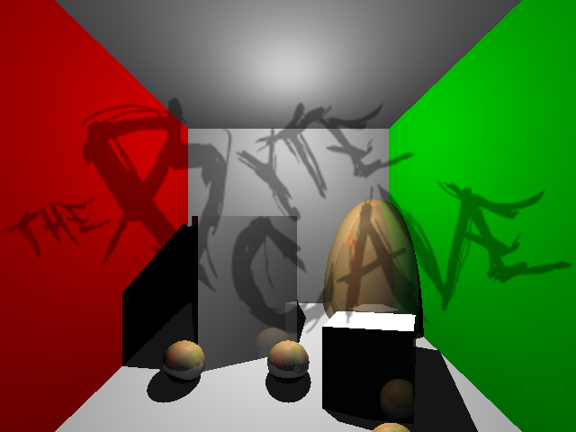
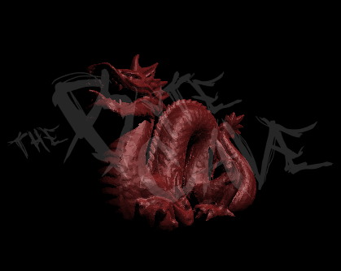

# Computer Graphics 101

This course will help you to understand the mathematics and algorithms necessary to perform
real time 3D graphics using a modern 3D API like OpenGL, DirectX or Vulkan.

Requisites
 * Linear algebra
 * Calculus
 * Data structure and algorithms
 * C and C++
 * Optimizing CPU programs

What this course is NOT about
 * Specifics on how to use a 3D API like Direct3D, Vulkan or OpenGL
 * Specifics on how to program in C or C++, or any other low level language, though is mandatory previous experience on any of those languages
 
Syllabus Part 1

 * 3D graphics pipeline & rasterization 
   * Pipeline stages
   * Matrices through the pipeline
   * The rasterization algorithm
   * Z-buffer
   
 * Project 0
   * Familiarize with the framework and solutions (Windows VS2017)
   * Familiarize with a particular API and real time rendering

 * Cameras, scenes graphs 
   * Matrices for the camera
   * Tansformations
   * Perspective and orthogonal cameras
   * Algorithms to build graphs
   * Derive formulas for the camera

 * Project 1
    * Manipulate a crystal ball and/or fly camera
    * Define and load scenes using general transformations
     
    
 * Blinn Phong lighting model and texturing
    * Lambertian term
    * Blinn-Phong model
    * Texturing
    
 * Project 2
    * Apply the lighting model to a general scene
   
 * Ray tracing
    * Stages
    * Intersection algorithms
    * Shadows
    * Reflection
    * Shading
    * Recursion

 * Project 3
    * Generate high quality images using ray tracing algorithms
    
 * Optimization (optional)
    * AABB
    * Space traversal
    * Multiple rays
    * Multi-threading
    * SIMD
 
 * Project 4
    * Get the most out of the CPU power using at least 3 or all the recommendedoptimizations

Part 2 of the course continues after the Ray Tracing assignment (Project 3). 
It is a mandatory to have completed with good scores all the 
previous projects (except otional sections).

Syllabus Part 2
 * Refraction
 * Project 1
 * Real time ray tracing using a modern API like Optix or DXR
 * Project 2
 * Global illumination
 * Project 3
 * The rendering equation
 * Project 4
 * Optimization (optional)
 * Project 5

Resources

* Physically Based Rendering: From theory to practice https://www.pbrt.org/

